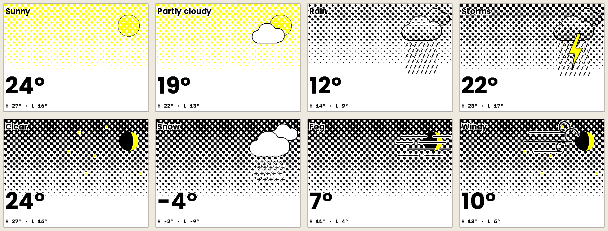
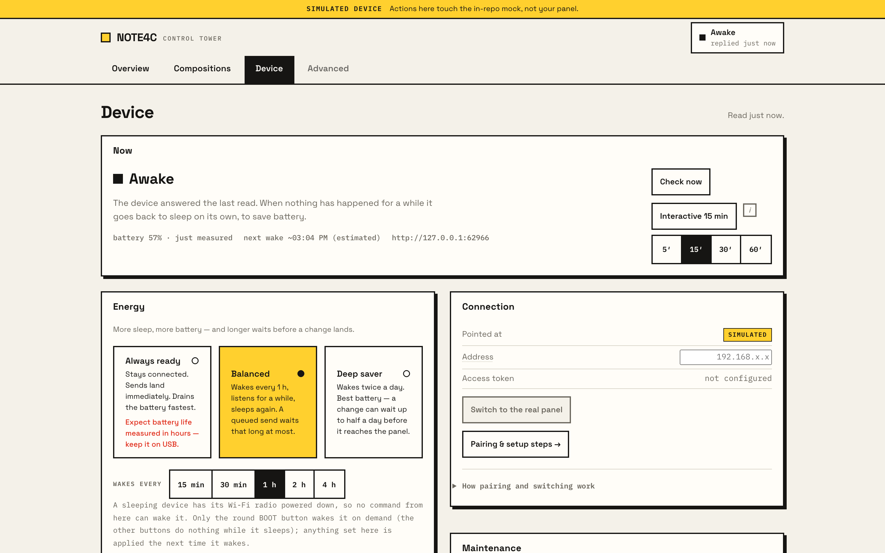
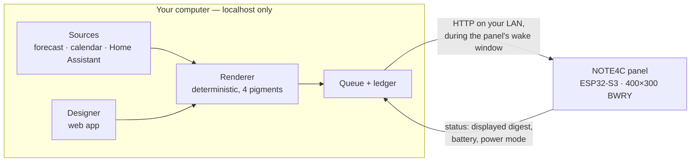

# Paperwake

**A calm, four-colour e-paper display for your home — designed on your own
machine, delivered over your own network, running on a battery.**


<sub>Every panel image on this page is a real render: the same code that packs
the bytes for the device, run over fictional data. No mock-ups.</sub>

Paperwake turns a [ZECTRIX ESP32-S3 e-paper panel](https://wiki.zectrix.com)
(the NOTE4C — 400 × 300, black · white · red · yellow) into a quiet display
for a desk, a wall or the fridge door. Weather, your agenda, a countdown, a
note to the house — composed in a paper-styled web app on your computer and
pushed to the panel over your LAN.

No cloud. No account. The composer binds to `localhost`, and the panel sleeps
between updates the way e-paper should.

---

## What you get

### A designer where the preview *is* the panel

Drag modules onto an 8 × 6 grid, pick a look, edit the words. The preview is
painted by the same deterministic renderer that produces the device's bytes —
same dithering, same four pigments, pixel for pixel. There is no prettier
preview to disagree with the glass.


### A risograph look, made for four colours

Red and yellow are costly on e-paper, so they are laid through a small
dithering engine — halftone dots, grain, grids — with one hard rule: an accent
is never finer than 2 px, so it always prints cleanly. Three colour stances
(black & white, balanced, expressive) re-skin a whole board in one click.

The **Weather hero** draws the sky it describes — eleven scenes, from a clear
day to a thunderstorm, each by day and by night, with the moon at its real
phase:



<sub>All 66 variants (11 scenes × day/night × 3 colour stances) are in
[`control-tower/docs/images/weather-hero/`](control-tower/docs/images/weather-hero/).</sub>

### Modules

| | |
| --- | --- |
| **Weather** | hero temperature with an illustrated sky · next 24 hours · 7-day strip · the weather octopus |
| **Time & calendar** | next events from your calendar · countdown · last updated |
| **Sky** | sunrise, sunset, day length and the moon — pure astronomy, no network |
| **Text** | headline · message · list · a message that appears only when a condition holds |
| **Home** | Home Assistant sensors |
| **Image** | any picture, dithered in the browser to the four pigments |

Missing data is drawn as missing — a module never falls back to a zero or an
invented number.

### Honest delivery to a device that is usually asleep

A battery panel spends most of its life in deep sleep with its radio off; no
packet can wake it. So Paperwake never pretends it can:

- A change aimed at a sleeping panel is **queued**, shown as pending, and
  delivered in the short window after the panel's own timer wakes it.
- Every push lands in an append-only ledger with a real state — `queued`,
  `sent`, `verified_displayed`, `uncertain`, `failed`. A frame only counts as
  displayed once the device reports that exact digest back.
- Press the panel's **BOOT** button and the composer notices within seconds.



---

## How it works



1. **Sources** are read on your machine — a forecast for coordinates you set, a
   calendar snapshot, sensors — and only for modules a dashboard actually uses.
2. **The renderer** turns a dashboard into a 30 000-byte frame. The browser
   preview runs the same TypeScript.
3. **The panel** wakes on its own timer (every 15 minutes up to twice a day,
   your choice); the composer catches that window, delivers, confirms, and the
   panel goes back to sleep.

---

## Try it in two minutes — no hardware needed

A faithful mock of the panel ships in the repo, so you can run the whole thing
without a device:

```bash
cd control-tower
npm install
npm run dev          # → http://localhost:8654
```

Set a passphrase on first run, pick a starting composition, press **Show on
panel**. Everything the mock returns is labelled `SIMULATED`.

When you have a panel, [`control-tower/QUICKSTART.md`](control-tower/QUICKSTART.md)
walks through pairing and the first real push.

---

## What's in this repository

| | What it is | Stack |
| --- | --- | --- |
| [**`control-tower/`**](control-tower/) | The composer: designer, renderer, sources, delivery queue, device page. Runs on your machine. | Next.js, TypeScript |
| [**`firmware/`**](firmware/) | What runs on the panel: render pipeline, LAN API, power management, the on-device UI. | ESP-IDF (C/C++), ESP32-S3 |

Go deeper:

- [Architecture](control-tower/docs/ARCHITECTURE.md) — how a pixel gets from a source to the glass
- [Design language](control-tower/docs/DESIGN-LANGUAGE.md) — the risograph engine and the designer's UX
- [Compatibility](control-tower/docs/COMPATIBILITY.md) — which panels and firmware levels have been tried
- [Firmware](firmware/README.md) — building, flashing, the device API
- [Security](control-tower/SECURITY.md) — what can leave your machine, and what never does

---

## Principles

- **Local-first.** The composer binds `localhost`; the panel must be a private
  LAN address. Every outbound request (forecast, Home Assistant…) is off until
  you configure it, and all of them are read-only.
- **The preview is the renderer.** One pipeline, byte-identical in the browser
  and on the device.
- **Never a zero in place of missing data.** `uncertain` is not `failed`; a
  stale forecast says it is stale.
- **Four colours, done carefully.** Red and yellow are never dithered below
  2 px.

---

## Status

A working, personal project, running on one panel at home.

Exercised on real hardware: pushes confirmed on the glass; battery operation
with timer wakes caught and delivered to autonomously; button wakes; the
push-to-talk voice path end to end. Not yet: more than one panel, more than
one home network, or a measured battery-life figure — this project publishes
none. The [compatibility notes](control-tower/docs/COMPATIBILITY.md) are the
honest limit of what has been tried.

## Provenance

The firmware is a consolidated fork of an upstream ESP32-S3 e-paper project;
its lineage, base revision and build hashes are documented in
[`firmware/ATTRIBUTION.md`](firmware/ATTRIBUTION.md) and
[`firmware/PROVENANCE-MANIFEST.md`](firmware/PROVENANCE-MANIFEST.md). The
composer is original work.

## Author

Built by [**@alexclmy**](https://github.com/alexclmy). Say hi on Twitter/X:
[**@ytiralugins**](https://x.com/ytiralugins).

## License

[MIT](LICENSE). The firmware keeps its upstream copyright notice in
[`firmware/LICENSE`](firmware/LICENSE) alongside this project's; see
`firmware/ATTRIBUTION.md`.

---

<sub>Paperwake is an **unofficial**, personal project. It is not affiliated
with, endorsed by, or supported by the panel's vendor.</sub>
